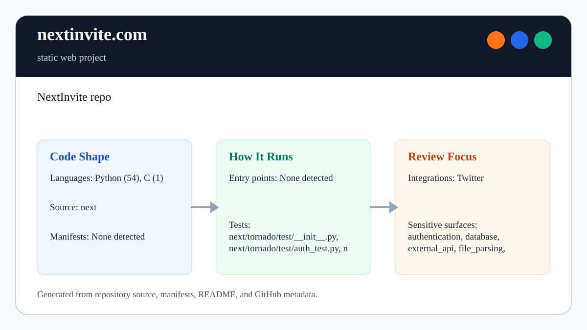

# nextinvite.com

<!-- README-OVERVIEW-IMAGE -->


## Overview

`garethpaul/nextinvite.com` is a static web project. NextInvite repo

This README is based on the checked-in source, manifests, scripts, and repository metadata on the `master` branch. The project language mix found during review was: Python (54), C (1).

## Repository Contents

- `next` - source or example code
- `SECURITY.md` - security reporting and disclosure guidance
- `VISION.md` - project direction and maintenance guardrails

Additional scan context:

- Source directories: next
- Dependency and build manifests: none detected
- Entry points or build surfaces: none detected
- Test-looking files: next/tornado/test/__init__.py, next/tornado/test/auth_test.py, next/tornado/test/curl_httpclient_test.py, next/tornado/test/escape_test.py, next/tornado/test/gen_test.py, next/tornado/test/httpclient_test.py, next/tornado/test/httpserver_test.py, next/tornado/test/httputil_test.py, and 4 more

## Getting Started

### Prerequisites

- Git

### Setup

```bash
git clone https://github.com/garethpaul/nextinvite.com.git
cd nextinvite.com
```

The setup commands above are derived from repository files. Legacy mobile, Python, or JavaScript samples may require older SDKs or package versions than a modern workstation uses by default.

## Running or Using the Project

- The legacy App Engine entry point is `next/server.py`, configured by
  `next/app.yaml`.
- Run the app with a compatible first-generation App Engine Python SDK when one
  is available.
- Invite signup emails are normalized, format-checked, and capped at the
  conventional 254-character address length before datastore writes.
- Idempotent signup keys use a prefixed SHA-256 digest of the normalized email
  so retries target the same entity without placing plaintext email in the key.
- Domain label validation rejects labels with leading/trailing hyphens or more
  than 63 characters before datastore writes.
- Domain label character validation rejects labels with underscores or
  non-ASCII characters before datastore writes.
- Local-part validation accepts bounded unquoted ASCII local parts, including
  plus tags, and rejects unsafe or non-ASCII characters before datastore writes.
- Top-level domain validation rejects one-character or all-numeric final labels
  before datastore writes.
- Dependency-free signup JavaScript posts invite requests without remote jQuery
  while preserving XSRF form serialization and text-only status updates.
- The signup form submit guard sends Enter-key form submissions through the
  same dependency-free invite request handler as button clicks.

## Testing and Verification

- `make lint`
- `make test`
- `make build`
- `make check`
- `python3 scripts/check-baseline.py`
- Pinned `ubuntu-24.04` GitHub Actions runs the same dependency-free baseline on
  Python 3.12 without App Engine deployment, datastore access, or external calls.

When the required SDK or runtime is unavailable, use static checks and source review first, then verify on a machine that has the matching platform toolchain.

## Configuration and Secrets

- Detected references to Parse, Twitter. Keep API keys, OAuth credentials, tokens, and account-specific values in local configuration only.
- Keep App Engine generated files, datastore exports, logs, `.env` files, and private signup email data out of git.

## Security and Privacy Notes

- Signup emails are private user data. Do not commit datastore exports or logs
  containing submitted addresses.
- The signup form and server validator both enforce the 254-character email
  length boundary before persistence.
- Email dot validation rejects leading, trailing, and consecutive dot cases before persistence.
- Domain label validation rejects leading/trailing hyphen labels and labels over
  63 characters before persistence.
- Domain label character validation allows only ASCII letters, digits, and
  interior hyphens before persistence.
- Local-part validation keeps signup addresses to bounded unquoted ASCII local
  parts before persistence.
- Top-level domain validation keeps final domain labels to plausible public
  email suffixes before persistence.
- Dependency-free signup JavaScript keeps the invite flow working without a
  remote script dependency.
- The signup form submit guard keeps keyboard submissions on the same XSRF-aware
  AJAX path as click submissions.
- Preserve idempotent signup key generation when changing datastore persistence.
- App Engine handlers are configured with `secure: always`, and templates should not disable Tornado autoescaping.
- Review changes touching authentication or token handling; examples from the scan include next/base.py, next/markdown.py, next/tornado/auth.py, next/tornado/database.py, and 6 more.
- Review changes touching external API calls or credential-adjacent configuration; examples from the scan include next/markdown.py, next/tornado/auth.py, next/tornado/autoreload.py, next/tornado/escape.py, and 6 more.
- Review changes touching network requests, sockets, or service endpoints; examples from the scan include next/base.py, next/markdown.py, next/server.py, next/static/style.css, and 6 more.
- Review changes touching mobile permissions or privacy-sensitive device data; examples from the scan include next/tornado/__init__.py, next/tornado/auth.py, next/tornado/autoreload.py, next/tornado/curl_httpclient.py, and 6 more.
- Review changes touching file, media, JSON, XML, CSV, OCR, or data parsing; examples from the scan include next/app.yaml, next/markdown.py, next/tornado/auth.py, next/tornado/autoreload.py, and 6 more.
- Review changes touching shell execution, subprocess, or dynamic evaluation; examples from the scan include next/tornado/autoreload.py, next/tornado/test/run_pyversion_tests.py.
- Review changes touching database, model, or persistence code; examples from the scan include next/server.py, next/tornado/database.py.
- Review changes touching infrastructure, proxy, cloud, or deployment configuration; examples from the scan include next/tornado/httpserver.py, next/tornado/test/httpserver_test.py.

## Maintenance Notes

- Run `make lint`, `make test`, `make build`, and `make check` before pushing
  route, template, App Engine config, or security documentation changes.
- See `docs/plans/2026-06-09-make-gate-aliases.md` for the local verification
  gate aliases.
- See `docs/plans/2026-06-09-dependency-free-signup-javascript.md` for the
  dependency-free signup JavaScript guardrail.
- See `docs/plans/2026-06-10-signup-form-submit-guard.md` for the signup form
  submit guardrail.
- See `SECURITY.md` for vulnerability reporting and safe research guidance.
- See `VISION.md` for project direction and contribution guardrails.

## Contributing

Keep changes small and tied to the project that is already present in this repository. For code changes, document the toolchain used, avoid committing generated dependency directories or local configuration, and update this README when setup or verification steps change.
